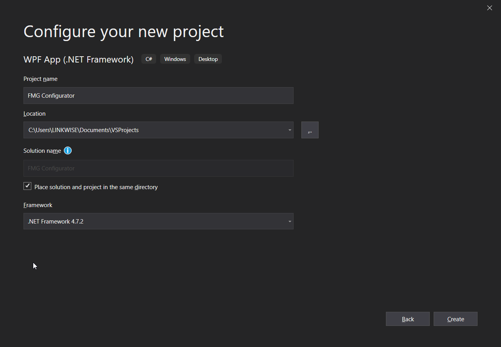

# Getting Started

First, we need to create  a project in Visual Studio.

1. Open Visual Studio 2019 and choose "Create a new project"


2. Select "WPF App (.NET Framework)" with your preferred language. For this project I used C#.


3. Configure your project by setting a title. For this project, we will call it **FMG Configurator**.


> Now we have created a blank application! This is where the magic happens. This is your blank slate, and you can do anything as you want with this application. But *ehem* we need to focus on creating the actual program. To continue we will need to add the MaterialDesignInXamlToolkit.

4. To add the materialDesign we need to get the package. On the solution explorer right-click the "References" drop-down and click "Manage NuGet Packages..."


5. Click on the "Browse" tab and search for "MaterialDesign". Click on Install and wait for it to be installed.


>If the image below is same as yours, then congratulations! You now have installed the package. A few steps left before starting the actual coding and design of the UI.


6. On the GitHub link before there are instructions on how to set this properly. But to make the story short, go to "App.xml" and add the following code inside `<Application.Resources>`:
```
<ResourceDictionary>
    <ResourceDictionary.MergedDictionaries>
        <ResourceDictionary Source="pack://application:,,,/MaterialDesignThemes.Wpf;component/Themes/MaterialDesignTheme.Defaults.xaml" />
        <ResourceDictionary Source="pack://application:,,,/MaterialDesignThemes.Wpf;component/Themes/MaterialDesignTheme.Dark.xaml" />
        <ResourceDictionary Source="pack://application:,,,/MaterialDesignColors;component/Themes/Recommended/Primary/MaterialDesignColor.Blue.xaml" />
        <ResourceDictionary Source="pack://application:,,,/MaterialDesignColors;component/Themes/Recommended/Accent/MaterialDesignColor.Purple.xaml" />
        <ResourceDictionary Source="pack://application:,,,/MaterialDesignThemes.Wpf;component/Themes/MaterialDesignTheme.Flipper.xaml" />
        <ResourceDictionary Source="pack://application:,,,/MaterialDesignThemes.Wpf;component/Themes/MaterialDesignTheme.DataGrid.xaml" />
    </ResourceDictionary.MergedDictionaries>
</ResourceDictionary>
```
In total, your code should look like this:
```
<Application x:Class="FMG_Configurator1.App"
             xmlns="http://schemas.microsoft.com/winfx/2006/xaml/presentation"
             xmlns:x="http://schemas.microsoft.com/winfx/2006/xaml"
             xmlns:local="clr-namespace:FMG_Configurator1"
             StartupUri="MainWindow.xaml">
    <Application.Resources>
        <ResourceDictionary>
            <ResourceDictionary.MergedDictionaries>
                <ResourceDictionary Source="pack://application:,,,/MaterialDesignThemes.Wpf;component/Themes/MaterialDesignTheme.Defaults.xaml" />
                <ResourceDictionary Source="pack://application:,,,/MaterialDesignThemes.Wpf;component/Themes/MaterialDesignTheme.Dark.xaml" />
                <ResourceDictionary Source="pack://application:,,,/MaterialDesignColors;component/Themes/Recommended/Primary/MaterialDesignColor.Blue.xaml" />
                <ResourceDictionary Source="pack://application:,,,/MaterialDesignColors;component/Themes/Recommended/Accent/MaterialDesignColor.Purple.xaml" />
                <ResourceDictionary Source="pack://application:,,,/MaterialDesignThemes.Wpf;component/Themes/MaterialDesignTheme.Flipper.xaml" />
                <ResourceDictionary Source="pack://application:,,,/MaterialDesignThemes.Wpf;component/Themes/MaterialDesignTheme.DataGrid.xaml" />
            </ResourceDictionary.MergedDictionaries>
        </ResourceDictionary>
    </Application.Resources>
</Application>
```
As you can see, I've set the theme to be "Dark", but you can do light theme if you want.

Now we're finished with setting up the project. Onwards to the next process!

[Serial Settings](SerialSettings.md)

