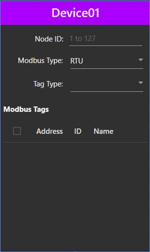

# Modbus Card
We will discuss here on how to create a userControl to be used in the ModbusSettings windows. I won't go deep here on how to use a userControl because there are so many tutorials online, but in case you need any links <a target="_blank" rel="noopener noreferrer" href="https://wpf-tutorial.com/usercontrols-and-customcontrols/creating-using-a-usercontrol/"> click here</a> and  <a target="_blank" rel="noopener noreferrer" href="https://docs.microsoft.com/en-us/dotnet/api/system.windows.controls.usercontrol?view=netframework-4.8">here</a>.

Let's proceed.

Add a userControl by clicking Project->Add User Control (WPF)... then rename it. I renamed mine ModbusCard.

Then add the following inside the `<UserControl>`
```xml
xmlns:materialDesign="http://materialdesigninxaml.net/winfx/xaml/themes"
mc:Ignorable="d" Height="410" Width="246"
```
And add additional UserControl Resources to control the alignment of text. This is essential later
```xml
<UserControl.Resources>
    <Style x:Key="centerAligned" TargetType="{x:Type TextBlock}">
        <Setter Property="TextAlignment" Value="Center"/>
    </Style>
</UserControl.Resources>
```
Add the Card element by calling `<materialDesign:Card>` and set the height and width similar to the userControl dimensions.

Inside it, add a Colorzone set the mode to "Dark". This will encompass the whole card.

Of course, add a stackpanel and grids for proper placement of UI items inside the card. For your convinience, I will add most of the code here.
```cs
<materialDesign:Card Height="410" Width="246" >
    <materialDesign:ColorZone Mode="Dark">
        <StackPanel>
            <materialDesign:ColorZone Mode="Accent">
                <StackPanel Height="39" >
                    <TextBlock Margin="5" Style="{StaticResource MaterialDesignTitleTextBlock}" x:Name="DeviceNameTextBlock" Text="Device01" VerticalAlignment="Center" HorizontalAlignment="Center"/>
                </StackPanel>
            </materialDesign:ColorZone>
            <StackPanel>
                <StackPanel Height="120">
                    <Grid HorizontalAlignment="Stretch" Margin="5">
                        <Grid.ColumnDefinitions>
                            <ColumnDefinition Width="Auto" MinWidth="104"/>
                            <ColumnDefinition Width="Auto" MinWidth="136"/>
                        </Grid.ColumnDefinitions>
                        <Grid.RowDefinitions>
                            <RowDefinition Height="Auto"/>
                            <RowDefinition Height="Auto"/>
                            <RowDefinition Height="Auto"/>
                        </Grid.RowDefinitions>
                        <TextBlock Grid.Row="0" Grid.Column="0" VerticalAlignment="Center" HorizontalAlignment="Right" Text="Node ID:" Margin="5"/>
                        <TextBox Grid.Row="0" Grid.Column="1" VerticalAlignment="Center" HorizontalAlignment="Left" x:Name="NodeIDTextBox" PreviewTextInput="NodeIDTextBox_PreviewTextInput" DataObject.Pasting="NodeIDTextBox_Pasting" MaxLength="3" TextChanged="NodeIDTextBox_TextChanged" materialDesign:HintAssist.Hint="1 to 127" materialDesign:HintAssist.HintOpacity="0.26" Margin="5" Width="120"/>
                        <TextBlock Grid.Row="1" Grid.Column="0" VerticalAlignment="Center" HorizontalAlignment="Right" Text="Modbus Type:" Margin="0,10.8,6,10.8" Height="16" Width="74"/>
                        <ComboBox Grid.Row="1" Grid.Column="1" x:Name="DAQModbusTypeComboBox" Margin="6,4.8,0,4.8" MinWidth="120" HorizontalAlignment="Left" Width="120" Height="28">
                            <ComboBoxItem IsSelected="True" Content="RTU" Tag="0" ToolTip="RS-485 Communication"/>
                            <ComboBoxItem Tag="1" Content="TCP/IP" ToolTip="Ethernet Communication"/>
                        </ComboBox>
                        <TextBlock Grid.Row="2" Grid.Column="0" VerticalAlignment="Center" HorizontalAlignment="Right" Text="Tag Type:" Margin="0,11.2,6,11.2" Height="16" Width="48"/>
                        <ComboBox Grid.Row="2" Grid.Column="1" x:Name="DAQTagTypeComboBox" HorizontalAlignment="Left" Margin="6,5.2,0,5.2" MinWidth="120" VerticalAlignment="Stretch" Width="120">
                            <ComboBoxItem Tag="0" Content="Modbus Coils(0x)" Name="MCTagType" Selected="MCTagType_Selected"/>
                            <ComboBoxItem Tag="1" Content="Discrete Inputs(1x)" Name="DITagType" Selected="DITagType_Selected"/>
                            <ComboBoxItem Tag="2" Content="Input Registers(3x)" Name="IRTagType" Selected="IRTagType_Selected"/>
                            <ComboBoxItem Tag="3" Content="Holding Registers(4x)" Name="HRTagType" Selected="HRTagType_Selected"/>
                        </ComboBox>
                    </Grid>
                </StackPanel>

                <StackPanel Orientation="Horizontal" Height="30">
                    <TextBlock Margin="5" Text="Modbus Tags" FontWeight="Bold" VerticalAlignment="Bottom"/>
                </StackPanel>
                <StackPanel Height="220">
                    <DataGrid Height="210" ScrollViewer.CanContentScroll="True" x:Name="TagSelection" Margin="5" CanUserAddRows="False" CanUserSortColumns="False" AutoGenerateColumns="False" materialDesign:DataGridAssist.CellPadding="2 2 2 2" materialDesign:DataGridAssist.ColumnHeaderPadding="5" IsEnabled="False">
                        <DataGrid.Columns>
                            <DataGridCheckBoxColumn Binding ="{Binding IsSelected}" ElementStyle="{StaticResource MaterialDesignDataGridCheckBoxColumnStyle}" EditingElementStyle="{StaticResource MaterialDesignDataGridCheckBoxColumnEditingStyle}">
                                <DataGridCheckBoxColumn.Header>
                                    <Border Background="Transparent" Padding="4 0 4 0" HorizontalAlignment="Center">
                                        <CheckBox HorizontalAlignment="Center" DataContext="{Binding RelativeSource={RelativeSource AncestorType={x:Type DataGrid}}, Path=DataContext}" x:Name="chkall" Checked="chkall_Checked" Unchecked="chkall_Unchecked"/>
                                    </Border>
                                </DataGridCheckBoxColumn.Header>
                            </DataGridCheckBoxColumn>
                            <DataGridTextColumn Header="Address" Binding="{Binding TagAddress}" ElementStyle="{StaticResource centerAligned}" EditingElementStyle="{StaticResource MaterialDesignDataGridTextColumnEditingStyle}"/>
                            <DataGridTextColumn Header="ID" Binding="{Binding TagID}" ElementStyle="{StaticResource centerAligned}" EditingElementStyle="{StaticResource MaterialDesignDataGridTextColumnEditingStyle}"/>
                            <DataGridTextColumn Header="Name" Binding="{Binding TagName}" ElementStyle="{StaticResource centerAligned}" EditingElementStyle="{StaticResource MaterialDesignDataGridTextColumnEditingStyle}"/>
                        </DataGrid.Columns>
                    </DataGrid>
                </StackPanel>
            </StackPanel>
        </StackPanel>
    </materialDesign:ColorZone>
    
</materialDesign:Card>
```
>Take note of the Datagrid. In their columns I added bindings, as this will be essential in the code-behind.

For now, this is what it would look like:



## CODE-BEHIND(.xaml.cs)

This will be quite a lot, but I know that you can do this because you're the chosen one and you've done so many challenges. Think of this as just another challenge, my child.

1. First, we will define namespaces
```cs
using System;
using System.Collections.Generic;
using System.Linq;
using System.Text.RegularExpressions;
using System.Windows;
using System.Windows.Controls;
using System.Windows.Input;
```

Then create a new list. We call it Users. Also, set a regex that will contain only numbers...
```cs
List<User> users = new List<User>();
private static readonly Regex regex = new Regex("[^0-9]+");
```

Next is that we will need to add a public class. We will call this class *User*. Inside the class we will declare input variables: TagAddress, TagID, TagName, and IsSelected. These are the binding addresses found in the Datagrid columns earlier.
```cs
public class User
{
    public int TagAddress { get; set; }
    public string TagID { get; set; }
    public string TagName { get; set; }
    public bool IsSelected { get; set; }
}
```


### MODBUS Type Selected Event
In this event we will add content to the Datagrid. But for that, we need to determine what type the user has selected. Let's take a look back in the combobox.
```xml
<ComboBox Grid.Row="2" Grid.Column="1" x:Name="DAQTagTypeComboBox" HorizontalAlignment="Left" Margin="6,5.2,0,5.2" MinWidth="120" VerticalAlignment="Stretch" Width="120">
    <ComboBoxItem Tag="0" Content="Modbus Coils(0x)" Name="MCTagType" Selected="MCTagType_Selected"/>
    <ComboBoxItem Tag="1" Content="Discrete Inputs(1x)" Name="DITagType" Selected="DITagType_Selected"/>
    <ComboBoxItem Tag="2" Content="Input Registers(3x)" Name="IRTagType" Selected="IRTagType_Selected"/>
    <ComboBoxItem Tag="3" Content="Holding Registers(4x)" Name="HRTagType" Selected="HRTagType_Selected"/>
</ComboBox>
```
The `Selected` event is same as `Click` or `Loaded` event. They are all found in the properties window of the UI element.

The program flows like this:
1. The list must be cleared first.
2. If the Datagrid is not enabled, enable it.
3. For a number of tag addresses available on the said type, add it via `.Add()` method for lists.
4. Set the Itemsource to null. Then set the Itemsource to `users`.

To give you an example:
```cs
private void DITagType_Selected(object sender, RoutedEventArgs e)
{
    users.Clear();

    if (!TagSelection.IsEnabled)
        TagSelection.IsEnabled = true;

    for (int i = 1; i < 17; i++)
        users.Add(new User() { TagAddress = i, TagID = $"M{i}", TagName = $"X{i}"});

    TagSelection.ItemsSource = null;
    TagSelection.ItemsSource = users;
}
```
Do the same for the other types, but set the number of tag address depending on the selected type.

---

### CheckBox all
As you can see in the DataGrid, there is a single checkbox. This will behave as either select all or select none. Write down two (2) events, checked and unchecked.
```cs
private void chkall_Checked(object sender, RoutedEventArgs e)
{
    TagSelection.Items.OfType<User>().ToList().ForEach(x => x.IsSelected = true);
    TagSelection.ItemsSource = null;
    TagSelection.ItemsSource = users;
}

private void chkall_Unchecked(object sender, RoutedEventArgs e)
{
    TagSelection.Items.OfType<User>().ToList().ForEach(x => x.IsSelected = false);
    TagSelection.ItemsSource = null;
    TagSelection.ItemsSource = users;
}
```
> For the TagSelection line, it only says that inside the list, every "IsSelected" must be set to *true* when checked and *false* when unchecked.

---

### NodeIDTextBox Listener
Since we only need numerical numbers as input, and need to prevent the user to input something greater than 127. The same as before, I don't really know how this works, but I just added a listener. Just do the same, hahahaha.
```cs
private void NodeIDTextBox_PreviewTextInput(object sender, TextCompositionEventArgs e) => e.Handled = !IsTextAllowed(e.Text);

private static bool IsTextAllowed(string text) => !regex.IsMatch(text);

private void NodeIDTextBox_Pasting(object sender, DataObjectPastingEventArgs e)
{
    if (e.DataObject.GetDataPresent(typeof(String)))
    {
        String text = (String)e.DataObject.GetData(typeof(String));
        if (!IsTextAllowed(text))
            e.CancelCommand();
    }
    else
        e.CancelCommand();
}

private void NodeIDTextBox_TextChanged(object sender, TextChangedEventArgs e)
{
    if (NodeIDTextBox.Text == "")
        return;

    if (int.Parse(NodeIDTextBox.Text) > 127)
    {
        MessageBox.Show("Maximum node ID is 127!");
        NodeIDTextBox.Text = "";
    }
        
    return;
}
```
DONE! Now we can use this for our ModbusSettings window! But before that, you must rebuild the whole project for the ModbusCard element to appear in your toolbox.