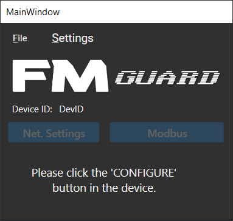
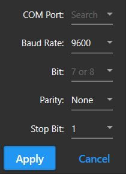
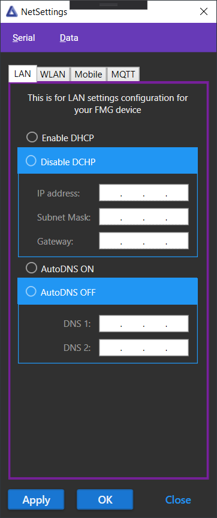
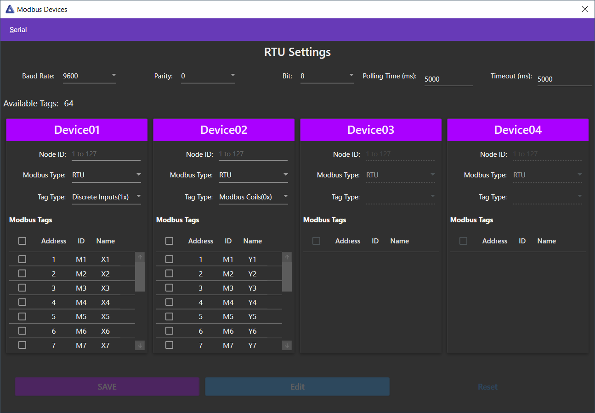

# FMG CONFIGURATOR

## Introduction
The software is developed with the use of Visual Studio 2019.

The general idea is to develop an app where we can access NX-400 through serial communication and configure network parameters and MODBUS parameters. This documentation is done to help understand how the software is developed and how to use it.

## Prerequisites
This program was made possible with some NuGet packages and other Github files

#### MaterialDesign
To make the UI look similar to the UI design, I grabbed the NuGet package of MaterialDesignInXamlToolkit. This package has all the tools you'll need for a great UI design.

https://github.com/MaterialDesignInXAML/MaterialDesignInXamlToolkit

#### IPMaskedTextBox
Another great tool from GitHub for implementing IP addresses to be used by the software. Made some changes to fully utilize this tool.
https://github.com/RuvenSalamon/IP-MaskedTextBox

## Know-hows
To make this software, we need to have an understanding of serial communication, MODBUS protocol, and RTCU IDE for co-implementation with NX-400.

## Screenshots

 

