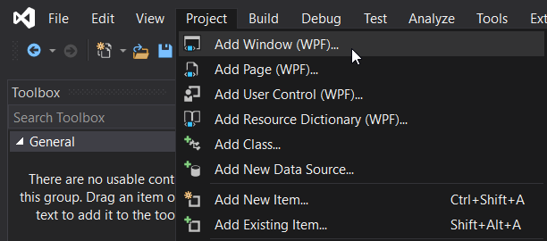

# Serial Settings

## 1. UI (XAML)
To create this window. Click on "Project" menu and click "Add Window (WPF)" 

We will name it "SerialSettings.xaml"


To adapt the material design look, we will add a few lines of code:
```
<Window x:Class="FMG_Configurator1.SerialSettings"
        xmlns="http://schemas.microsoft.com/winfx/2006/xaml/presentation"
        xmlns:x="http://schemas.microsoft.com/winfx/2006/xaml"
        xmlns:d="http://schemas.microsoft.com/expression/blend/2008"
        xmlns:mc="http://schemas.openxmlformats.org/markup-compatibility/2006"
        xmlns:local="clr-namespace:FMG_Configurator1"
        mc:Ignorable="d"
        Background="{DynamicResource MaterialDesignPaper}"
        TextElement.Foreground="{DynamicResource MaterialDesignBody}"
        Title="SerialSettings" Height="235" Width="171.39" ResizeMode="NoResize" SizeToContent="WidthAndHeight" WindowStyle="None" Loaded="SerialMenu_Loaded" Closing="SerialMenu_Closing" WindowStartupLocation="CenterScreen">
    <Grid>
        
    </Grid>
</Window>
```
Next, inside the grid we will create a few stackpanels to organize the layout. Here's a few clues on the code:
```
<StackPanel>
    <StackPanel Orientation="Horizontal">
    </StackPanel>
    <StackPanel Orientation="Horizontal">
    </StackPanel>
    <StackPanel Orientation="Horizontal">
    </StackPanel>
    <StackPanel Orientation="Horizontal">
    </StackPanel>
    <StackPanel Orientation="Horizontal">
    </StackPanel>
    <StackPanel Orientation="Horizontal">
    </StackPanel>

</StackPanel>
```

You need to fill up between the stackpanel with textblocks, comboboxes, and grids then on the last one is where we'll put the buttons "Apply" and "Cancel".

With the help of the demo app from MaterialDesignInXamlToolkit, I used some of the ideas for buttons, textboxes, comboboxes, and textblocks e.g.
```
<ComboBox x:Name="ComPortComboBox" Margin="5" materialDesign:HintAssist.Hint="Search" materialDesign:HintAssist.HintOpacity=".26" Width="55" IsReadOnly="True"/>
```
The naming convention of the comboboxes are related to what they contain and what they are. E.g. for com port we will call them ***ComPortComboBox***. Apply this naming convention for all items.

We also need to add items to other comboboxes. Here is the clue for how to do it:
```
<ComboBox x:Name="StopBitComboBox" Margin="5" materialDesign:HintAssist.Hint="Search" materialDesign:HintAssist.HintOpacity=".26" Width="55" IsReadOnly="True">
    <ComboBoxItem Content="1" IsSelected="True"/>
    <ComboBoxItem Content="2"/>
</ComboBox>
```

This is the end look of the UI:


## 2. Code-behind
For every xaml file there is a code-behind file, this is where the cool stuff happens. 

### Globals.cs
Before moving to the actual code of the Serial Settings window, we need to make a class to contain global variables.
For others, this might be wrong to create them but this is what I can do for now.

First, we need to add a class by clicking on **Project->Add Class** and rename it to *Globals*.

Inside the class we will create a public static string for serial parameters (com port, baud rate, bit, parity, bit, and stopbit), a bool, and a global variable for the Device ID.
```cs
 class Globals
    {
        //for serial communication
        public static string comport;
        public static string baudrate;
        public static string uparity;
        public static string bit;
        public static string ustopbit;

        // for checking later
        public static bool firstTime = true;
        public static bool first = true;

        //for receiving data from device
        public static string devID;
    }
```
Save it, then now we can proceed with the code-behind of the "Serial Settings" window.

### SerialSettings.xaml.cs
Since we're going to make this app using c# language, all code-behind will be done in .cs file.

We need to define some namespaces to be used in the code. For this, we will only need two (3) namespaces: System, System.Windows, and System.IO.Ports.
```cs
using System;
using System.Windows;
using System.IO.Ports;
```

Next we will also define a variable for loading other windows. We will advance quite a bit as we will declare a future window.

```cs
public static MainWindow mainWindow = new MainWindow();
public static NetSettings netSettings = new NetSettings();
```

To cread a window event let's look back at xaml. When you click on the `<Window>` code, you can see the properties of that window. Rename it to anything you want, but for this example, I named it to **SerialMenu**. Once done, click on the lightning icon and find the "Loaded" event. Double-click on the textbox and it will generate a name of itself as you can see below.


This will also show in the xaml code as you can see below:

`
Title="SerialSettings" Height="235" Width="171.39" ResizeMode="NoResize" SizeToContent="WidthAndHeight" WindowStyle="None" Loaded="SerialMenu_Loaded" Closing="SerialMenu_Closing" WindowStartupLocation="CenterScreen">
`

Let's get back on the code-behind and write the following inside the "SerialMenu_Loaded" event:

```cs
private void SerialMenu_Loaded(object sender, RoutedEventArgs e)
{
    string[] ports = SerialPort.GetPortNames();
    foreach (var port in ports)
        ComPortComboBox.Items.Add(port);
}
```
the array *ports* will contain all available COM ports on your PC as stated in the first line of the code. Then all of the content of the array will be added into the *ComPortComboBox*.

For "Closing" event, we will cancel the close event and just set the visibility to be collapsed. We will also set the value of *Globals.first* to false to prevent re-running of the permanent closing inside the "CancelButton Click" event.
```cs
private void SerialMenu_Closing(object sender, System.ComponentModel.CancelEventArgs e)
{
    Globals.first = false;
    e.Cancel = true;
    Visibility = Visibility.Collapsed;
}
```
### Events
Next, we will go back and create a click event for the *Apply* button. This is the same as the window event earlier, but we need to find the "Click" event.

inside the "Click" event, we need to check first if the user has selected a value for *ComPortComboBox* and *BaudRateComboBox*. If no value is detected, we will show an error stating that the user needs to fill up values, and return immediately, cancelling the event.

```cs
if (ComPortComboBox.Text == "" | BaudRateComboBox.Text == "")
{
    MessageBox.Show("Please fill all values!");
    return;
}
```
If there are values we will proceed with saving it to the global variables stated earlier.
`Globals.comport = ComPortComboBox.Text;`

Do the same for other variables, then show a message saying that it's done, and open the main window using *.Show()*.

You should have the code similar to this:

```cs
private void Button_Click(object sender, RoutedEventArgs e)
{
    //check for comport and baudrate values
    if (ComPortComboBox.Text == "" | BaudRateComboBox.Text == "")
    {
        MessageBox.Show("Please fill all values!");
        return;
    }

    Globals.comport = ComPortComboBox.Text;
    Globals.baudrate = BaudRateComboBox.Text;
    Globals.uparity = ParityComboBox.Text;
    Globals.bit = BitComboBox.Text;
    Globals.ustopbit = StopBitComboBox.Text;

    MessageBox.Show("Settings applied!");
    mainWindow.Show();
    Close();
}
```
For *Cancel* button, clicking this would mean the end of the world!

Nah, just kidding. We just need to set it so that when it is clicked, it will permanently close the program.

What I did is I created a MessageBoxResult variable to contain what the user clicked when prompted with a message box. Then if this says "Yes", then we will permanently shut down the whole program.

For this to be used when changing the parameters, we will set this inside an "if" statement to determine if this is the first time that it will load:

```cs
private void CancelButton_Click(object sender, RoutedEventArgs e)
{
    if (Globals.first)
    {
        MessageBoxResult result = MessageBox.Show("Are you sure?", "Alert", MessageBoxButton.YesNo, MessageBoxImage.Exclamation);
    
        if (result == MessageBoxResult.Yes)
            Environment.Exit(0);
    }
    else
    {
        mainWindow.Show();
        Close();
    }
}

```
Lastly, we will check on Parity Methods. Since the bit can be 7 or 8 when the Parity is either Even or Odd, we will create the following two (2) events:

```
private void ParityNone(object sender, RoutedEventArgs e)
    {
        BitComboBox.Items.Clear();
        BitComboBox.Items.Add("8");
    }

private void ParityOther(object sender, RoutedEventArgs e)
    {
        BitComboBox.Items.Clear();
        BitComboBox.Items.Add("7");
        BitComboBox.Items.Add("8");
    }
```
> [!IMPORTANT]
> Make sure to set the BitComboBox is declared before the ParityComboBox to prevent null exception.

Set this event to the comboboxitems of the ParityComboBox. Use "Selected" event for this. ParityNone for "None", and ParityOther for both "Even" and "Odd".

Congratulations! Now we're finished with the **SerialSettings** window. 1 down, 5 to go!
On to the next window, my faithful adventurer!

[Main Window](MainWindow.md)