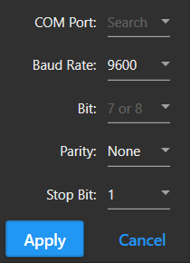
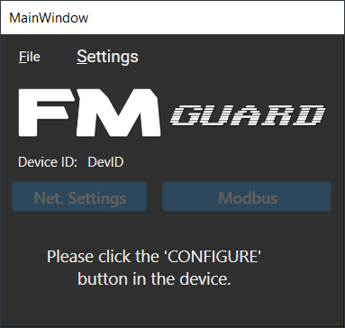

# User Manual
Greetings!

Thank you for choosing to use this software. This is made with configuring the device (NX-400) in mind. Take note though that your device must be updated to the latest firmware for you to be able to use this software.

## Serial Settings
Before starting the software, you must connect the device to your PC using a serial cable. Connect it to RS-485 port 1 of your device.

Upon starting the software, you will be prompted with serial parameters. This must be the same with your device.

Select the COM port where your serial cable is connected, then set other parameters to be the same as your device. Make sure that all parameters have values before clicking **Apply** button.

## Main Window
Once the serial parameters have been applied, the main window will pop up.

Please follow the instruction and when done, this will change into this:

To close the software, click on *File* menu and click on *Exit*. You will be prompted if your sure, click *Yes*.

## Network Settings
Click on the *Net. Settings* button, and this window will pop up.

First, click on *Serial Menu* and click *Open*. Once done, this all buttons will be enabled.

Fill up all needed information if necessary, then click *Apply* if you want to send only data from the selected tab, or *OK* if you want to send all data to the device. 

To close serial connection between device and PC, click on *Serial* menu and click *Close*. If not, you can close the window and do other configuration.

## Modbus Configuration
In the main window, click on *Modbus* button to open modbus configuration window.

Click *Serial* menu and click *Open* to enable buttons and cards.

Edit or provide the necessary information for RTU settings. This will be the parameters needed to communicate with your modbus slaves.

The software will provide up to 64 tags as per limit of your master device (NX-400). Each card pertains to 1 DAQ device. Provide the necessary Node ID, the tag type and the tag addresses to be used per device.

Each tag type has its own tag addresses. For example, Discrete Inputs(1x) has 16 available tag addresses.

You can edit the name per each tag address as preferred.

Once done with the selection, you can now click *Save* to send all data to your device. You can send only 1 device, or can send all device parameters.

To close the serial connection, click *Serial* and click *Close*.

Congratulations! You have now configured your device. You can now operate it as you want.

If you want to reconfigure again, there is no need to reset the software, just click on the *CONFIGURE* button in the device and you can edit/renew all parameters.

Thank you for using this software.

